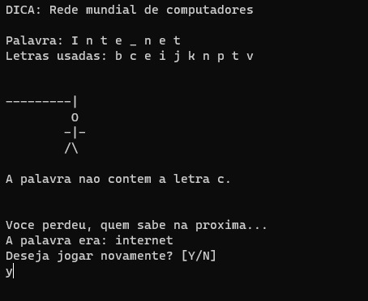

# Informações

Bem, esse foi um projeto feito por mim com a intenção de aprender um pouco de C, o que realmente aconteceu, aprendi algumas coisas nisso e treinar outras também.  
E meu primeiro codigo praticamente, entao nao julgue se estiver muito cagado, mas qualquer critica e sugestão é bem vinda. :D

# Imagens

